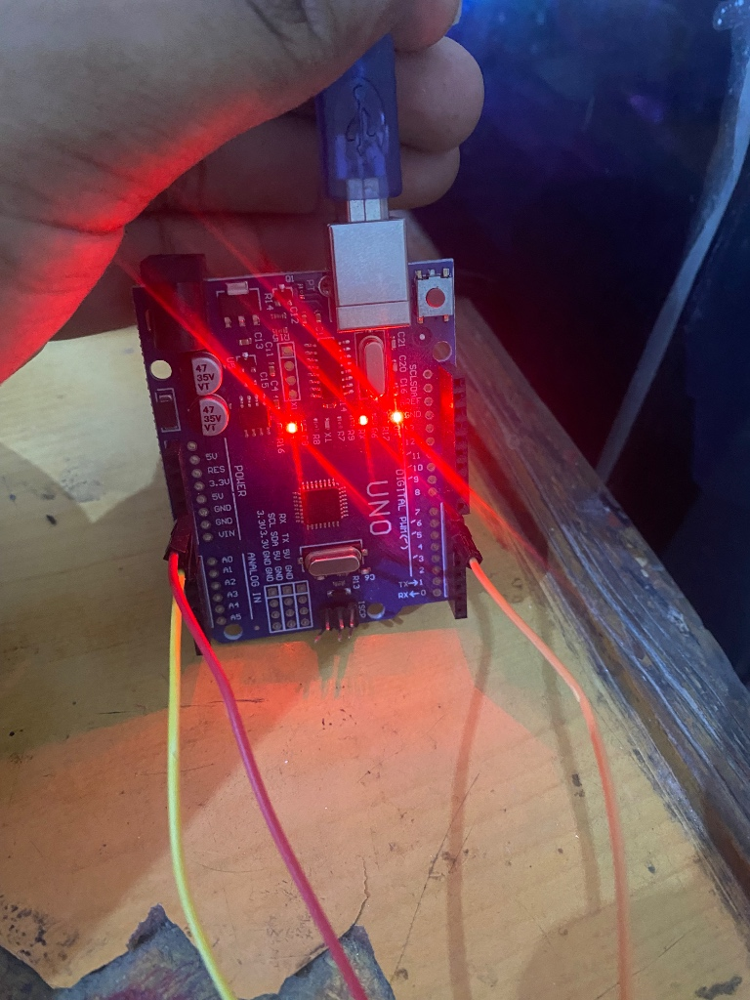
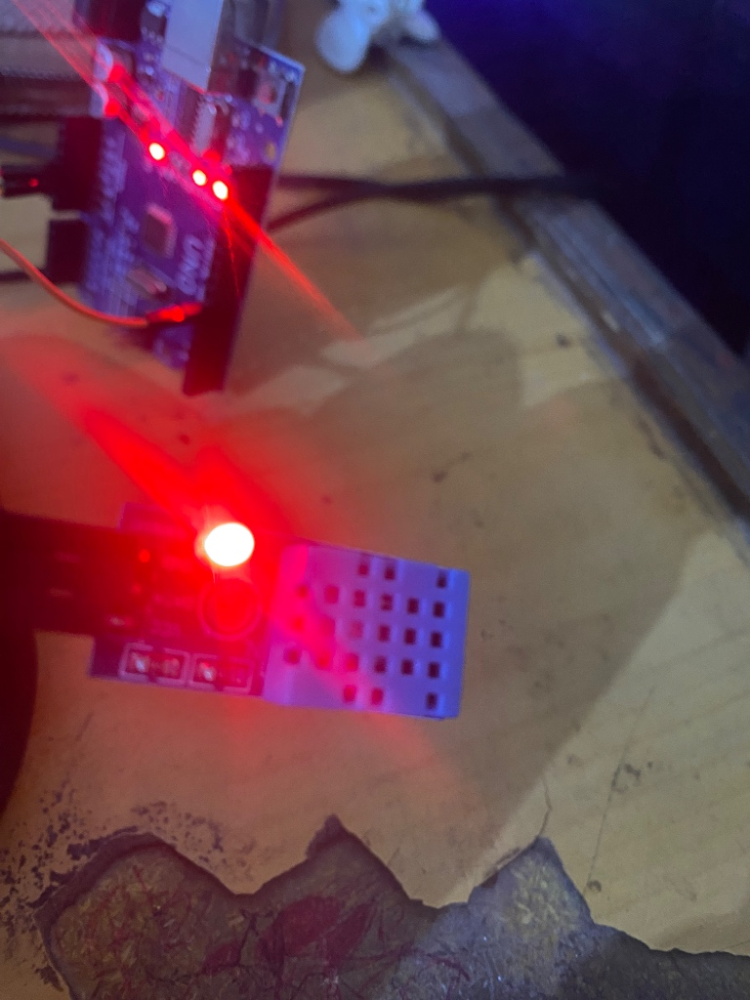

# Heat Wave (Temperature & Humidity Monitor)

An Arduino project that monitors temperature and humidity using a DHT11 sensor and displays the data on the serial monitor.

## Components Used

- Arduino (Uno/Nano)
- DHT11 Temperature & Humidity Sensor
- Breadboard & Jumper Wires

## Pin Configuration

| Component      | Arduino Pin |
| -------------- | ----------- |
| DHT11 Data Pin | D7          |

## Features

- Real-time temperature monitoring in Celsius
- Real-time humidity monitoring as percentage
- Error handling for sensor read failures
- Serial monitor output every 2 seconds

## Project Photos

### Setup 1

### Setup 2

## How It Works

1. DHT11 sensor reads temperature and humidity data
2. Sensor data is validated to check for read errors
3. If data is valid, humidity and temperature values are printed to serial monitor
4. System waits 2 seconds before taking the next reading
