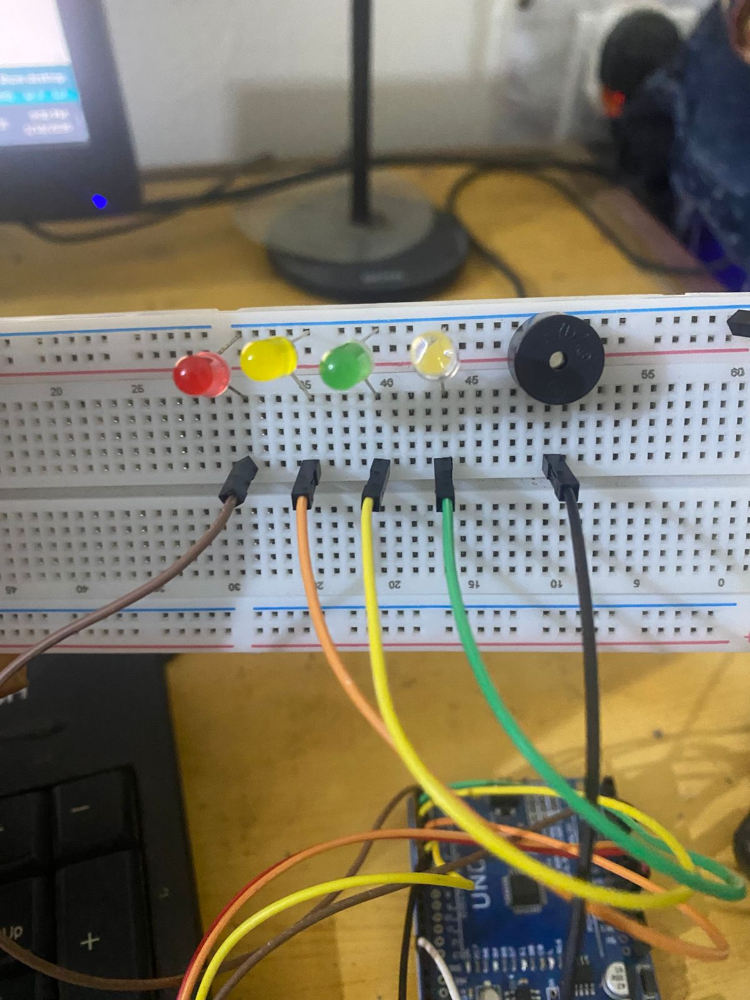
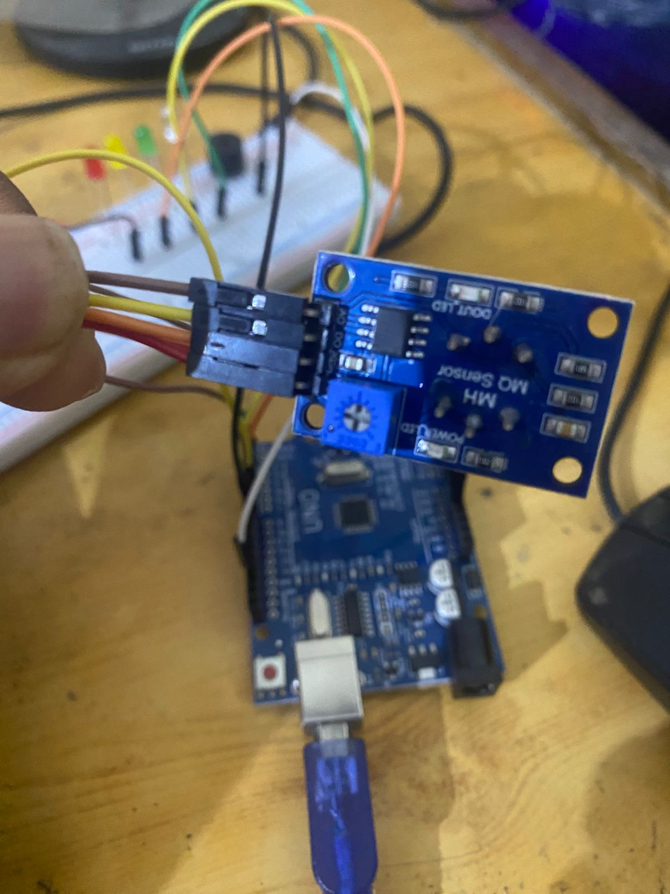
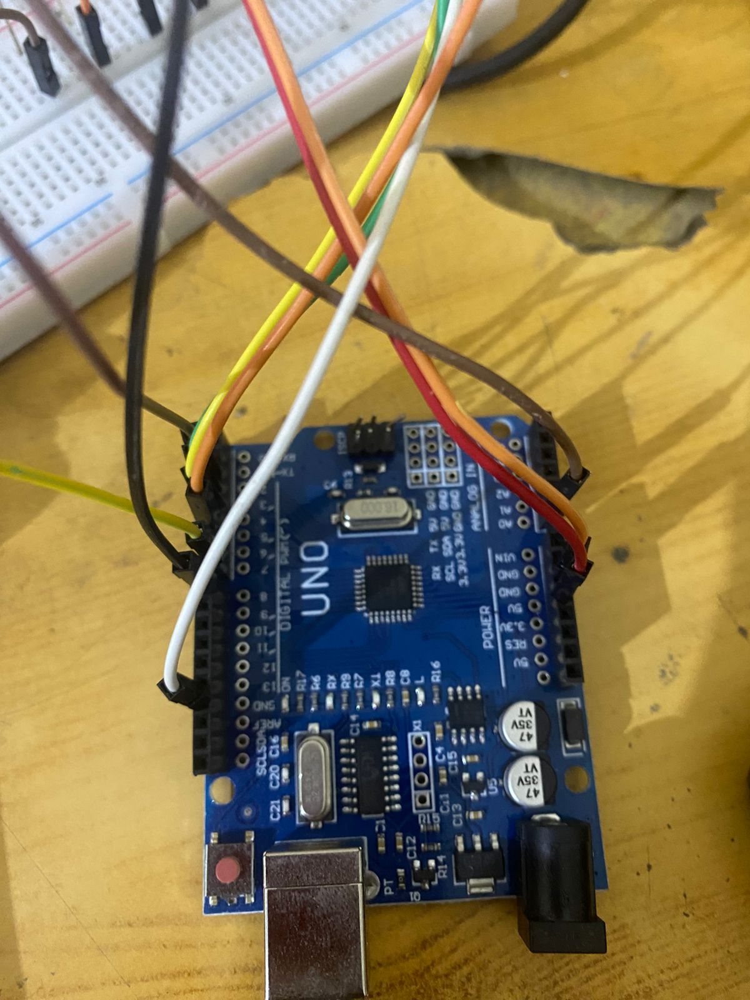
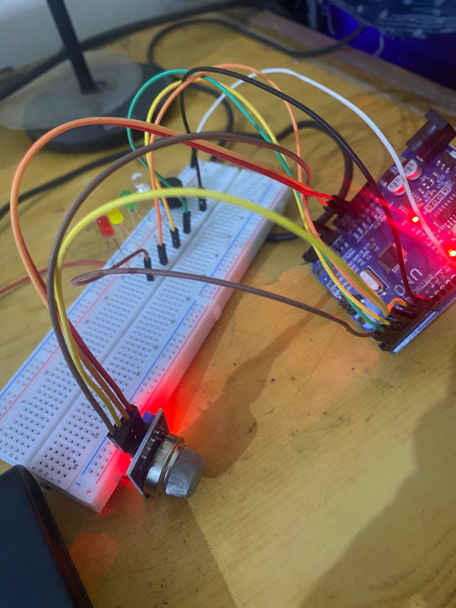

# Kitchen Safety Automation

An Arduino-based kitchen safety system that detects gas leaks using an MQ-6 sensor and alerts with LEDs and a piezo buzzer.

## Components Used
- Arduino (Uno/Nano)
- MQ-6 Gas Sensor
- LEDs (Red, Yellow, Green, White)
- Piezo Buzzer
- Breadboard & Jumper Wires

## Pin Configuration
| Component         | Arduino Pin |
|-------------------|-------------|
| MQ-6 AO           | A0          |
| MQ-6 DO           | D7          |
| Red LED           | D6          |
| Yellow LED        | D5          |
| Green LED         | D4          |
| White LED         | D3          |
| Piezo Buzzer      | D8          |

## Features
- Real-time gas level monitoring (analog)
- Digital gas detection
- Visual alert with all LEDs
- Audible alert with piezo buzzer
- Serial monitor output for debugging

## Project Photos

### Setup 1

### Setup 2

### Setup 3

### Setup 4

## How It Works
1. MQ-6 sensor reads gas concentration
2. If analog reading exceeds threshold (350), alert activates
3. All LEDs turn on
4. Buzzer sounds
5. Serial monitor shows real-time data
